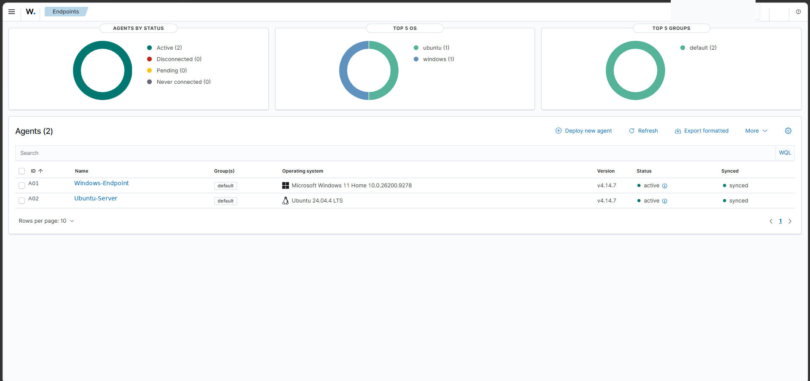
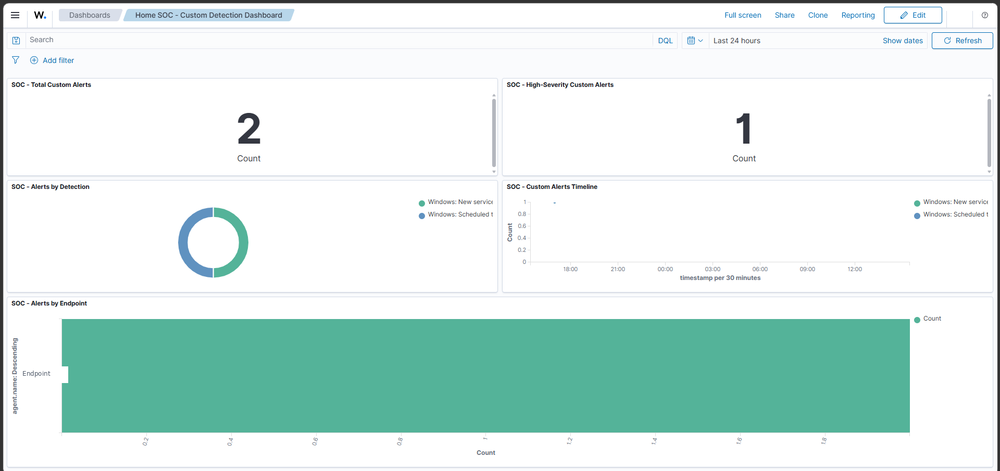
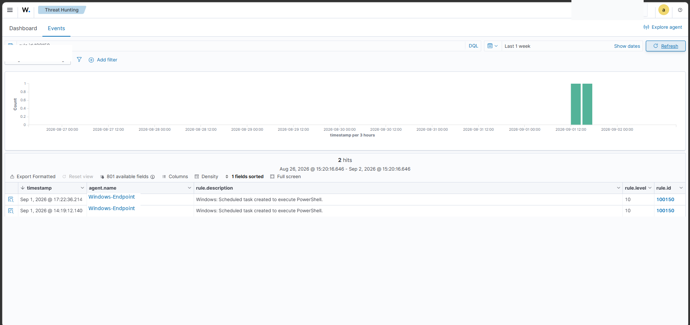
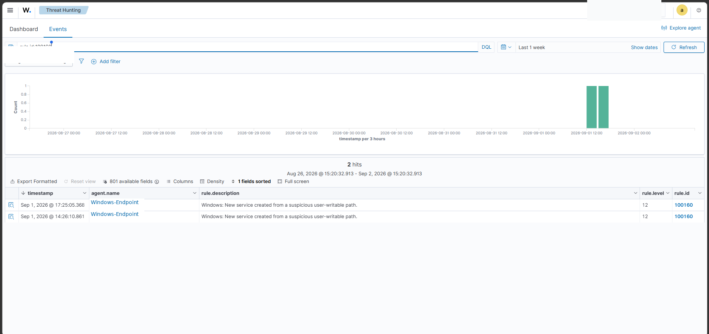
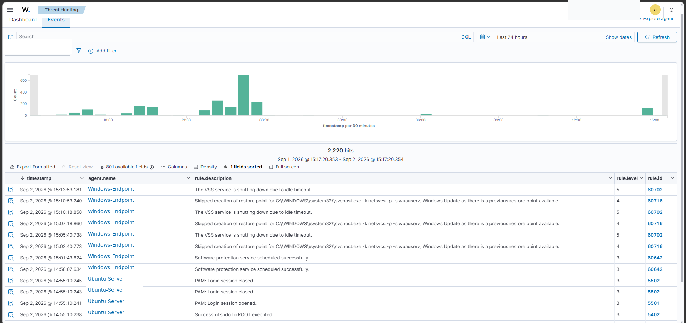

# Home SOC / SIEM Lab

A hardened Home SOC / SIEM project built around **Wazuh 4.14.7**, designed for practical learning, detection engineering, incident investigation, and interview-ready documentation.

The goal was not simply to install a SIEM. The project demonstrates an end-to-end security monitoring workflow: collecting telemetry, building and validating detections, reducing false positives, investigating controlled incidents, enforcing least privilege, securing network exposure, and validating backup/recovery.

---

## Project Highlights

- Windows 11 and Ubuntu endpoint monitoring
- Wazuh single-node deployment with Docker Compose
- Sysmon telemetry tuned for useful signal without excessive noise
- Custom detection engineering with MITRE ATT&CK mapping
- Built-in Wazuh rule validation and duplicate-rule retirement
- False-positive tuning for Docker/auditd noise
- Controlled incident simulations and investigation notes
- Read-only SOC user with least-privilege access
- Private Tailscale-based agent connectivity
- Dashboard access through SSH tunnel + reverse proxy
- 90-day alert retention
- Encrypted Restic backups
- Quiesced Wazuh Manager state backup with container-level stop and integrity validation
- Independent/offline USB Restic recovery copy with full repository read-data verification and selected restore validation
- Sanitized public portfolio package and documentation

---

## Architecture

~~~mermaid
flowchart TD
    W[Windows 11 Laptop Wazuh Agent + Sysmon]
    U[Ubuntu HomeServer Wazuh Agent]

    T[Tailscale Private Network Agent traffic: TCP 1514]

    M[Wazuh Manager Docker]
    I[Wazuh Indexer Docker Internal]
    D[Wazuh Dashboard Docker Internal]

    N[Nginx Proxy Manager localhost only]
    B[Laptop Browser SSH Tunnel]

    R[Encrypted Restic Backup]
    H[Backup HDD LUKS Encrypted]

    W --> T
    T --> M
    U --> M
    M --> I
    I --> D
    D --> N
    N --> B
    M --> R
    R --> H
~~~

---

## Monitored Endpoints

| Endpoint | Operating System | Telemetry | Status |
|---|---|---|---|
| `Windows-Endpoint` | Windows 11 | Windows Event Logs + Sysmon | Active |
| `Ubuntu-Server` | Ubuntu 24.04 LTS | Linux authentication, SSH, journald, auditd and Wazuh telemetry | Active |

Windows log sources include:

- Security
- System
- Application
- Microsoft Defender Operational
- PowerShell Operational
- Sysmon Operational

---

## Sysmon Tuning

Sysmon was configured to prioritize useful security telemetry rather than enabling every event type.

Key telemetry includes:

- Process creation
- Selected network connections
- Selected DNS queries
- File creation in security-relevant writable locations
- Persistence-related registry activity

Examples of monitored locations:

- `Users\Public`
- `AppData\Local\Temp`
- `Windows\Temp`
- `Startup`
- `Downloads`
- Run / RunOnce registry locations
- Winlogon registry locations

Broad noisy collection was intentionally avoided in v1.

---

## Detection Engineering

The project follows a simple detection lifecycle:

**Create → Test → Compare → Tune or Retire → Document**

The goal is to avoid keeping custom detections when Wazuh already provides suitable built-in coverage.

### Active Custom Detection — Rule 100150

Detects creation of a Windows Scheduled Task configured to execute PowerShell.

- Severity: **Level 10**
- MITRE ATT&CK:
  - `T1053.005` — Scheduled Task
  - `T1059.001` — PowerShell
- Positive and negative tests completed

### Active Custom Detection — Rule 100160

Detects creation of Windows services from suspicious user-writable paths.

- Severity: **Level 12**
- MITRE ATT&CK:
  - `T1543.003` — Windows Service
- Positive and negative tests completed

### False-Positive Tuning — Rule 100140

Suppresses a narrowly defined benign Docker/auditd condition involving Docker-created `veth` interfaces and `dockerd`.

The rule was tested to confirm that unrelated activity still reaches the original Wazuh detection.

### Retired Custom Rules

| Retired Rule | Reason | Current Built-in Coverage |
|---|---|---|
| `100100` | Overlapping Windows failed-logon correlation; built-in coverage judged sufficient | `60204` |
| `100110` | Duplicate sudo failure logic | `5401 / 5404` |
| `100120` | Duplicate SSH invalid-user correlation | `5712` |
| `100130` | Duplicate encoded PowerShell logic | `92057` |

See [`docs/DETECTIONS.md`](docs/DETECTIONS.md) for the full detection notes.

---

## Controlled Incident Simulations

Four lab incidents are documented:

1. Multiple failed Windows logons
2. PowerShell Scheduled Task creation
3. Suspicious Windows Service creation
4. Multiple Linux SSH invalid-user attempts

All are explicitly documented as **controlled lab simulations**.

See [`docs/INCIDENTS.md`](docs/INCIDENTS.md).

---

## Custom Detection Dashboard

The project includes a dedicated dashboard:

**Home SOC - Custom Detection Dashboard**

It contains:

- Total Custom Alerts
- High-Severity Custom Alerts
- Alerts by Detection
- Custom Alerts Timeline
- Alerts by Endpoint

Wazuh Threat Hunting is used for the broader built-in + custom alert workflow.

---

## Least Privilege

A dedicated SOC account, `soc-readonly`, was created and tested.

It can:

- View agents
- View alerts
- Use Threat Hunting
- Review MITRE information

It cannot:

- Manage Wazuh security settings
- Manage users or roles
- Deploy agents
- Perform administrative security actions

---

## Network Hardening

The Wazuh environment is not directly exposed to the public Internet.

Normal host exposure is intentionally minimal:

- TCP `1514` — Wazuh agent traffic over the private Tailscale network
- TCP `1515` — closed during normal operation
- TCP `9200` — internal only
- TCP `55000` — internal only
- Dashboard — not directly published to the host

The Dashboard access path is:

**Browser → SSH Tunnel → Nginx Proxy Manager → Wazuh Dashboard**

No Wazuh container has the Docker socket mounted.

---

## Retention

### Indexer

Alert indices use:

`wazuh-alert-retention-90d`

The policy was validated on the existing alert index and then again on a newly created daily alert index to confirm automatic inheritance.

### Local Manager Alerts

Dated local Wazuh alert archives use a 90-day threshold with weekly cleanup.

Safety controls ensure the cleanup does not touch active `alerts.log` or `alerts.json`.

---

## Backup and Recovery

The HomeLab uses an encrypted Restic backup system with a LUKS-protected backup disk.

The Wazuh Manager backup includes important state such as:

- `/var/ossec/etc`
- Agent keys
- Custom rules
- API configuration
- Wazuh databases
- Queue state
- Logs
- Filebeat configuration
- Additional Manager state

The hardened backup flow temporarily suppresses automatic Manager-container restart, gracefully stops Filebeat and Wazuh, fully stops the Manager container, copies the required state while the container is stopped, then starts the environment and verifies Wazuh, Filebeat and Indexer connectivity before restoring the normal restart policy. Compression is performed after service recovery to reduce downtime.

Validation completed:

- Backup helper completed successfully
- Automated backup completed successfully
- gzip archive integrity passed
- Archive extraction passed
- Required files were present
- SQLite `PRAGMA integrity_check` passed
- Ownership and permissions were preserved
- Agents returned to Active after backup

See [`docs/RECOVERY.md`](docs/RECOVERY.md).

---

## Project Demonstration

### 1. Endpoint Monitoring

Windows 11 and Ubuntu endpoints actively monitored by Wazuh without exposing private IP addresses.

### 2. Custom Detection Dashboard

A focused dashboard showing custom detections, severity, timeline, and affected endpoints.

### 3. Rule 100150 — PowerShell Scheduled Task

Controlled-lab hits for the custom Scheduled Task + PowerShell detection.

### 4. Rule 100160 — Suspicious Windows Service

Controlled-lab hits for the suspicious Windows Service path detection.

### 5. Threat Hunting

Centralized Windows and Linux security events investigated through Wazuh Threat Hunting.

### 6. Backup Validation

See [`evidence/06-backup-recovery.txt`](evidence/06-backup-recovery.txt).

Automated encrypted backup completed successfully and the Wazuh Manager archive passed integrity verification.

For the complete screenshot walkthrough, see [`SCREENSHOTS.md`](SCREENSHOTS.md).

---

## Documentation

- [`docs/DETECTIONS.md`](docs/DETECTIONS.md) — Detection engineering
- [`docs/INCIDENTS.md`](docs/INCIDENTS.md) — Incident investigation reports
- [`docs/RECOVERY.md`](docs/RECOVERY.md) — Backup and recovery runbook
- [`docs/STABILITY.md`](docs/STABILITY.md) — Seven-day stability validation
- [`docs/FINAL-QA.md`](docs/FINAL-QA.md) — Final QA report
- [`SCREENSHOTS.md`](SCREENSHOTS.md) — Portfolio evidence walkthrough

---

## Security Decisions

The project intentionally does **not** use:

- Public Wazuh exposure
- Permanent TCP 1515 enrollment exposure
- Public Wazuh API
- Public Wazuh Indexer
- Docker socket access from Wazuh
- Active Response on real endpoints
- Broad Sysmon collection
- PowerShell Script Block Logging in v1
- Large numbers of duplicate custom rules
- Artificial multi-node complexity

The design goal is a **small, hardened, explainable SOC**.

---

## Known Limitations

This is a Home SOC, not an enterprise HA deployment.

Current v1 limitations:

- Single Wazuh node
- Two monitored endpoints
- No full clean-system restoration of all historical Indexer data
- No full clean-system DR exercise
- No physically off-site recovery copy; an independent/offline USB recovery path has been validated
- No automated Active Response
- No dedicated attack VM

These are intentional design decisions rather than hidden gaps.

---

## Phase 2 Ideas

Possible future improvements:

- Full functional Disaster Recovery exercise
- Full clean-system OpenSearch snapshot recovery exercise
- Independent off-site recovery
- Dedicated isolated test VM
- Controlled PowerShell Script Block Logging testing
- Active Response testing in an isolated lab endpoint
- Additional detections only where built-in coverage is insufficient

---

## Status

**Home SOC / SIEM v1 — COMPLETE.**

Final operational sign-off was completed on **2026-09-10**.

Continued operational evidence through **2026-09-18** shows successful daily scheduled HomeLab backup notifications on every date from **2026-09-06 through 2026-09-18**. The latest confirmed success was **2026-09-18 03:31:56 IDT**.

The detailed post-hardening Wazuh validation remains based on the 2026-09-09 and 2026-09-10 runs.

The final validation included:

- two consecutive successful scheduled HomeLab backups after the final Wazuh backup hardening
- quiesced Wazuh Manager state capture with the Manager container fully stopped
- successful Filebeat recovery and Indexer connectivity
- successful OpenSearch snapshots with zero failed shards
- successful Restic snapshots
- clean AIDE validation
- all 29 expected containers running
- backup filesystem unmounted and LUKS backup vault closed
- independent/offline USB recovery validation

The project is now in normal maintenance mode.

Residual limitations are documented rather than hidden: the USB copy is not physically off-site, full clean-system Disaster Recovery has not been claimed, and F03/F04 post-reboot runtime persistence remains for a future planned reboot.
